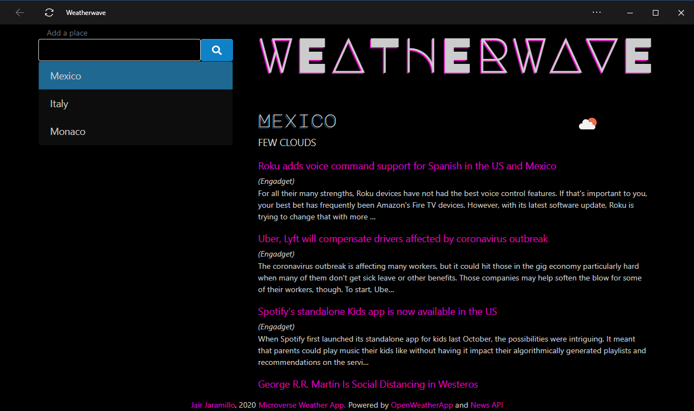

<p align="center">
  <a href="https://www.microverse.org/">
  
  </a>
</p>

<center><h1>Microverse 605: Weather App</h1></center>

<center><h2><a href="https://jairjy.github.io/Microverse-605-Weather-App" target="_blank">Check a live version of this project</a><h2></center>

## About The Project

This project is a web app where the user can add as many countries as they want, the weather of the selected country will be shown on the right side of the site. Additionally, some news of the country appears.

<p align="center">
  
</p>

### Built With

This app was made using this technologies

* <a href="https://www.javascript.com/" target="_blank">Javascript</a>
* <a href="https://nodejs.org/en/" target="_blank">Node JS</a>
* <a href="https://www.npmjs.com/" target="_blank">NPM</a>
* <a href="https://getbootstrap.com/" target="_blank">Bootstrap</a>
* <a href="https://stickler-ci.com/" target="_blank">Stickler</a>

This app also uses these services/APIs:
* <a href="https://openweathermap.org/" target="_blank">OpenWeatherApp</a>[]()
* <a href="" target="_blank"></a>[News API](https://newsapi.org/)

## Getting Started
To get a local copy up and running follow these simple example steps:

### Prerequisite Instalations
* Git
* Nodejs
* NPM

If you're using an Ubuntu Linux Distribution or derivate, you can install these programs by using these commands in your Linux Terminal:

```sh
sudo apt update
sudo apt install git
curl -sL https://deb.nodesource.com/setup_13.x | sudo -E bash -
sudo apt-get install -y nodejs
```

* If you're using Microsoft Windows, the Git installer can be found <a href="https://gitforwindows.org/" target="_blank">here</a>, and Node JS/NPM installer can be found <a href="https://nodejs.org/en/download/" target="_blank">here</a>.
* If you have another type of Linux Distribution, you can check how to install Node JS and NPM by checking <a href="https://nodejs.org/en/download/package-manager/" target="_blank">this article</a>.

### Installation

Clone this GitHub repository:
```sh
git clone https://github.com/rmauritsson/todo-list.git
```
Go to the repository folder and install the NPM modules:

```sh
npm install
```

Then, generate output files:

```sh
npm run dev
```
For development mode, and:

```sh
npm run build
```
For production.
## Usage

After NPM generates the output files, open the "index.html" file located on the "dist" folder.

Then you can add the countries you like using the form on the upper left.

## License

Distributed under the MIT License. See `LICENSE` for more information.

<!-- CONTACT -->

## Contact

* Jair Jaramillo: <a href="https://github.com/jairjy" target="_blank">Github</a>, <a href="https://twitter.com/jairjy" target="_blank">Twitter</a>

Project Link: <a href="https://github.com/jairjy/Microverse-605-Weather-App" target="_blank">https://github.com/jairjy/Microverse-605-Weather-App</a>

<!-- ACKNOWLEDGEMENTS -->

## Acknowledgements

* <a href="https://www.microverse.org/" target="_blank">Microverse</a>
* <a href="https://www.theodinproject.com/" target="_blank">The Odin Project</a>
* <a href="https://www.w3schools.com/" target="_blank">W3Schools</a>
